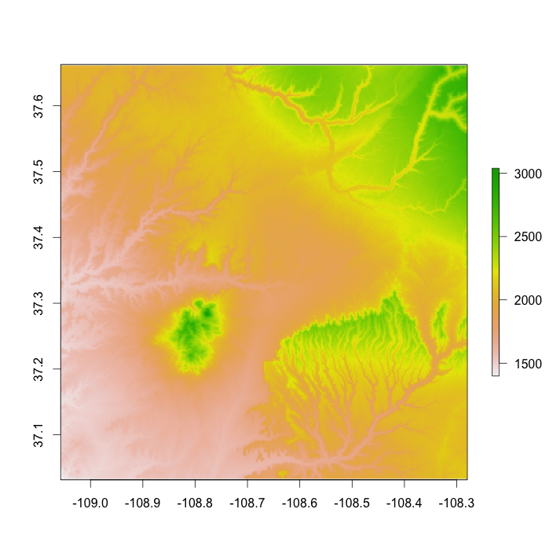
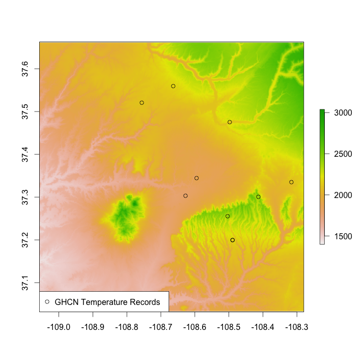
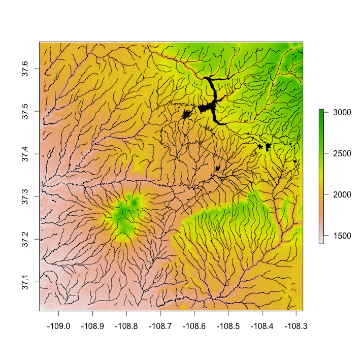
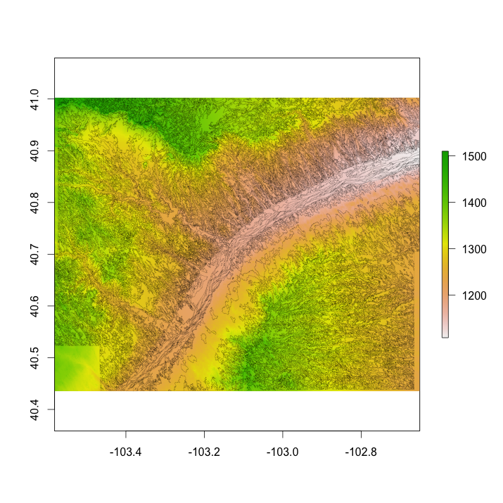
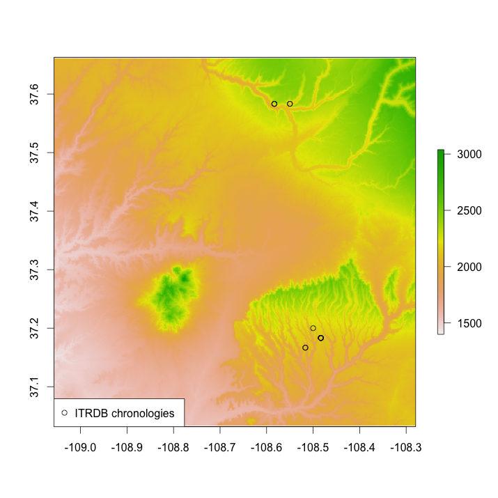

FedData
========

[](https://travis-ci.org/bocinsky/FedData)
[](https://github.com/metacran/cranlogs.app)
[](http://cran.rstudio.com/web/packages/FedData)

`FedData` is an *R* package implementing functions to automate downloading geospatial data available from several federated data sources (mainly sources maintained by the US Federal government). Currently, the package allows for retrieval of five datasets: 

* The [National Elevation Dataset (NED)](http://ned.usgs.gov) digital elevation models (1 and 1/3 arc-second; USGS)
* The [National Hydrography Dataset (NHD)](http://nhd.usgs.gov) (USGS)
* The [Soil Survey Geographic (SSURGO) database](http://websoilsurvey.sc.egov.usda.gov/) from the National Cooperative Soil Survey (NCSS), which is led by the Natural Resources Conservation Service (NRCS) under the USDA,
* The [Global Historical Climatology Network (GHCN)](http://www.ncdc.noaa.gov/data-access/land-based-station-data/land-based-datasets/global-historical-climatology-network-ghcn), coordinated by National Climatic Data Center at NOAA, and
* The [International Tree Ring Data Bank (ITRDB)](http://www.ncdc.noaa.gov/data-access/paleoclimatology-data/datasets/tree-ring), coordinated by National Climatic Data Center at NOAA.

Additional data sources are in the works, including global DEM resources ([ETOPO1](https://www.ngdc.noaa.gov/mgg/global/global.html), [STRM](http://www2.jpl.nasa.gov/srtm/)), global soils ([HWSD](http://webarchive.iiasa.ac.at/Research/LUC/External-World-soil-database/HTML/)), [MODIS](http://modis.gsfc.nasa.gov) satellite data products, the [National Atlas](http://nationalmap.gov/small_scale/) (US only), [Natural Earth](http://www.naturalearthdata.com), [PRISM](http://www.prism.oregonstate.edu), and [WorldClim](http://www.worldclim.org).

This package is designed with the large-scale geographic information system (GIS) use-case in mind: cases where the use of dynamic web-services is impractical due to the scale (spatial and/or temporal) of analysis. It functions primarily as a means of downloading tiled or otherwise spatially-defined datasets; additionally, it can preprocess those datasets by extracting data within an area of interest (AoI), defined spatially. It relies heavily on the [**sp**](http://cran.r-project.org/package=sp), [**raster**](http://cran.r-project.org/package=raster), and [**rgdal**](http://cran.r-project.org/package=rgdal) packages.

I recommend [Homebrew](http://brew.sh) for installing *R* and GDAL:

`brew install gdal --with-complete --with-opencll --with-unsupported --with-libkml --with-python`

(adding the `--HEAD` tag will install the latest development version.)

`brew install r --with-openblas`

Remember, if installing *R* with Homebrew, you must **completely** remove old *R* installations, including the *R* framework, typically installed at `/Library/Frameworks`. This package has been built and tested on a source (Homebrew) install of *R* on Mac OS 10.10 (Yosemite), and has been successfully run on an Ubuntu Linux cluster, and binary installs of *R* on Mac OS 10.10 (Yosemite) and Windows 7.

### Development
+ [Kyle Bocinsky](http://bocinsky.io) - Crow Canyon Archaeological Center, Cortez, CO

### Contributors
+ [Dylan Beaudette](http://casoilresource.lawr.ucdavis.edu/people/dylan-e-beaudette/) - USDA-NRCS Soil Survey Office, Sonora, CA

### Install `FedData`
+ CRAN:
```r
install.packages('FedData')
```

+ Development version from GitHub:
```r
install.packages("devtools")
library(devtools)
install_github("bocinsky/FedData")
library(FedData)
```

Some OS X systems have trouble installing the `rgdal` package from source. If your install fails, and you've installed the [Homebrew](http://brew.sh) version of GDAL and *R*, try the following command (from within *R*):
```r
install.packages("rgdal", configure.args="--with-proj-include=/usr/local/include --with-proj-lib=/usr/local/lib")

# Then try the FedData install again
install.packages('FedData')
```

### Demonstration
This demo script is available in the `/inst` folder at the location of the installed package.

#### Load `FedData` and define a study area
```r
# Load FedData
library(FedData)

# Set a directory for testing
testDir <- "~/FedData Test"
# and create it if necessary
dir.create(testDir, showWarnings=F, recursive=T)
setwd(testDir)

# Extract data for the Village Ecodynamics Project "VEPIIN" study area:
# http://village.anth.wsu.edu
vepPolygon <- polygon_from_extent(raster::extent(672800,740000,4102000,4170000),
                                  proj4string="+proj=utm +datum=NAD83 +zone=12")
```

#### Get and plot the National Elevation Dataset for the study area
```r
# Get the NED (USA ONLY)
# Returns a raster object
NED <- get_ned(template=vepPolygon,
               label="VEPIIN")

# Plot with raster::plot
raster::plot(NED)
```


#### Get and plot the daily GHCN precipitation data for the study area
```r
# Get the daily GHCN data (GLOBAL)
# Returns a list: the first element is the spatial locations of stations,
# and the second is a list of the stations and their daily data
GHCN.prcp <- get_ghcn_daily(template=vepPolygon, 
                            label="VEPIIN",
                            elements=c('prcp'))
# Plot the spatial locations of stations with precipitation data
plot(GHCN.prcp$spatial, pch=1, add=T)
legend('bottomleft', pch=1, legend="GHCN Precipitation Records")
```


#### Get and plot the daily GHCN temperature data for the study area
```r
# Elements for which you require the same data
# (i.e., minimum and maximum temperature for the same days)
# can be standardized using standardize==T
# which ensures that stations have both tmin and tmax data
GHCN.temp <- get_ghcn_daily(template=vepPolygon, 
                            label="VEPIIN", 
                            elements=c('tmin','tmax'), 
                            standardize=T)
# Plot the NED again
raster::plot(NED)
# Plot the spatial locations
plot(GHCN.temp$spatial, add=T, pch=1)
legend('bottomleft', pch=1, legend="GHCN Temperature Records")
```


#### Get and plot the National Hydrography Dataset for the study area
```r
# Get the NHD (USA ONLY)
NHD <- get_nhd(template=vepPolygon, 
               label="VEPIIN")
# Plot the NED again
raster::plot(NED)
# Plot the NHD data
plot(NHD$NHDFlowline, add=T)
plot(NHD$NHDLine, add=T)
plot(NHD$NHDArea, col='black', add=T)
plot(NHD$NHDWaterbody, col='black', add=T)
```



#### Get and plot the NRCS SSURGO data for the study area
```r
# Get the NRCS SSURGO data (USA ONLY)
SSURGO.VEPIIN <- get_ssurgo(template=vepPolygon, 
                            label="VEPIIN")
# Plot the NED again
raster::plot(NED)
# Plot the SSURGO mapunit polygons
plot(SSURGO.VEPIIN$spatial,
     lwd=0.1,
     add=T)
```


#### Get and plot the NRCS SSURGO data for particular soil survey areas
```r
# Or, download by Soil Survey Area names
SSURGO.areas <- get_ssurgo(template=c("CO670","CO075"), 
                           label="CO_TEST")

# Let's just look at spatial data for CO675
SSURGO.areas.CO675 <- SSURGO.areas$spatial[SSURGO.areas$spatial$AREASYMBOL=="CO075",]

# And get the NED data under them for pretty plotting
NED.CO675 <- get_ned(template=SSURGO.areas.CO675,
                            label="SSURGO_CO675")
               
# Plot the SSURGO mapunit polygons, but only for CO675
plot(NED.CO675)
plot(SSURGO.areas.CO675,
     lwd=0.1,
     add=T)
```


#### Get and plot the ITRDB chronology locations in the study area
```r
# Get the ITRDB records
ITRDB <- get_itrdb(template=vepPolygon,
                   label="VEPIIN",
                   makeSpatial=T)
                   
# Plot the NED again
raster::plot(NED)
# Map the locations of the tree ring chronologies
plot(ITRDB$metadata, pch=1, add=T)
legend('bottomleft', pch=1, legend="ITRDB chronologies")
```

========

### Acknowledgements
This package is a product of SKOPE ([Synthesized Knowledge of Past Environments](http://www.envirecon.org)) and the [Village Ecodynamics Project](http://village.anth.wsu.edu). This software is licensed under the [MIT license](https://opensource.org/licenses/MIT).