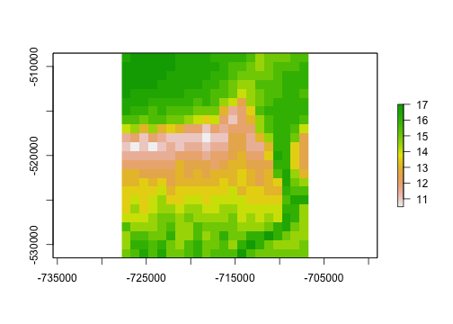
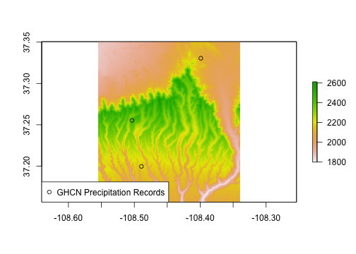
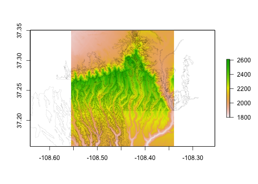
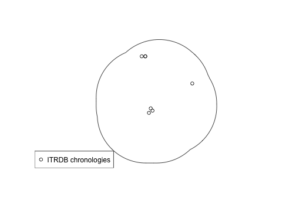

<!-- README.md is generated from README.Rmd. Please edit that file -->

[](https://www.repostatus.org/#active)
[](https://cran.r-project.org/package=FedData)
[](https://github.com/r-hub/cranlogs.app)
[](https://github.com/r-hub/cranlogs.app)
[](https://github.com/ropensci/FedData/actions/workflows/check-standard.yaml)
[](https://app.codecov.io/gh/ropensci/FedData?branch=master)
[](https://doi.org/10.5281/zenodo.596344)
[](https://github.com/ropensci/software-review/issues/13)

**FedData version 3.0 has been released to CRAN! There are several
breaking changes in the FedData API from version 2.x. Please see
[NEWS.md](NEWS.md) for a list of changes.**

`FedData` is an *R* package implementing functions to automate
downloading geospatial data available from several federated data
sources.

Currently, the package enables extraction from seven datasets:

- The [National Elevation Dataset (NED)](https://ned.usgs.gov) digital
  elevation models (1 and 1/3 arc-second; USGS)
- The [National Hydrography Dataset
  (NHD)](https://www.usgs.gov/national-hydrography/national-hydrography-dataset)
  (USGS)
- The [Soil Survey Geographic (SSURGO)
  database](https://websoilsurvey.sc.egov.usda.gov/) from the National
  Cooperative Soil Survey (NCSS), which is led by the Natural Resources
  Conservation Service (NRCS) under the USDA
- The [Global Historical Climatology Network
  (GHCN)](https://www.ncei.noaa.gov/products/land-based-station/global-historical-climatology-network-daily),
  coordinated by National Climatic Data Center at NOAA
- The [Daymet](https://daymet.ornl.gov/) gridded estimates of daily
  weather parameters for North America, version 4, available from the
  Oak Ridge National Laboratory’s Distributed Active Archive Center
  (DAAC)
- The [International Tree Ring Data Bank
  (ITRDB)](https://www.ncei.noaa.gov/products/paleoclimatology/tree-ring),
  coordinated by National Climatic Data Center at NOAA
- The [National Land Cover Database (NLCD)](https://www.mrlc.gov/)
- The [NASS Cropland Data
  Layer](https://www.nass.usda.gov/Research_and_Science/Cropland/SARS1a.php)
  from the National Agricultural Statistics Service

This package is designed with the large-scale geographic information
system (GIS) use-case in mind: cases where the use of dynamic
web-services is impractical due to the scale (spatial and/or temporal)
of analysis. It functions primarily as a means of downloading tiled or
otherwise spatially-defined datasets; additionally, it can preprocess
those datasets by extracting data within an area of interest (AoI),
defined spatially. It relies heavily on the
[**sf**](https://cran.r-project.org/package=sf) and
[**terra**](https://cran.r-project.org/package=terra) packages.

### Development

- [Kyle Bocinsky](https://www.bocinsky.io) - Montana Climate Office,
  Missoula, MT

### Contributors

- Dylan Beaudette - USDA-NRCS Soil Survey Office, Sonora, CA
- Jeffrey Hollister - US EPA Atlantic Ecology Division, Narragansett, RI
- Scott Chamberlain - ROpenSci and Museum of Paleontology at UC Berkeley

### Install `FedData`

- From CRAN:

``` r
install.packages("FedData")
```

- Development version from GitHub:

``` r
install.packages("devtools")
devtools::install_github("ropensci/FedData")
```

- Linux: Follow instructions for installing `sf` available at
  <https://r-spatial.github.io/sf/>.

### Demonstration

This demonstration script is available as an R Markdown document in the
GitHub repository: <https://github.com/ropensci/FedData>.

#### Load `FedData` and define a study area

``` r
# FedData Tester
library(FedData)
library(magrittr)

# FedData comes loaded with the boundary of Mesa Verde National Park, for testing
FedData::meve
```

#### Get and plot the National Elevation Dataset for the study area

``` r
# Get the NED (USA ONLY)
# Returns a raster
NED <- get_ned(
  template = FedData::meve,
  label = "meve"
)
# Plot with raster::plot
raster::plot(NED)
```


#### Get and plot the Daymet dataset for the study area

``` r
# Get the DAYMET (North America only)
# Returns a raster
DAYMET <- get_daymet(
  template = FedData::meve,
  label = "meve",
  elements = c("prcp", "tmax"),
  years = 1980:1985
)
# Plot with raster::plot
raster::plot(DAYMET$tmax$X1985.10.23)
```



#### Get and plot the daily GHCN precipitation data for the study area

``` r
# Get the daily GHCN data (GLOBAL)
# Returns a list: the first element is the spatial locations of stations,
# and the second is a list of the stations and their daily data
GHCN.prcp <- get_ghcn_daily(
  template = FedData::meve,
  label = "meve",
  elements = c("prcp")
)
#> Warning: attribute variables are assumed to be spatially constant throughout
#> all geometries
#> Warning in CPL_write_ogr(obj, dsn, layer, driver,
#> as.character(dataset_options), : GDAL Error 1:
#> /private/var/folders/ys/7l0z3wlx7z14qxn9v0m9ckhw0000gq/T/RtmpGwfFJu/FedData/extractions/ghcn/meve/meve_GHCN_stations.shp
#> does not appear to be a file or directory.
# Plot the NED again
raster::plot(NED)
# Plot the spatial locations
sp::plot(GHCN.prcp$spatial,
  pch = 1,
  add = TRUE
)
#> Warning in plot.sf(GHCN.prcp$spatial, pch = 1, add = TRUE): ignoring all but
#> the first attribute
legend("bottomleft",
  pch = 1,
  legend = "GHCN Precipitation Records"
)
```



#### Get and plot the daily GHCN temperature data for the study area

``` r
# Elements for which you require the same data
# (i.e., minimum and maximum temperature for the same days)
# can be standardized using standardize==T
GHCN.temp <- get_ghcn_daily(
  template = FedData::meve,
  label = "meve",
  elements = c("tmin", "tmax"),
  years = 1980:1985,
  standardize = TRUE
)
# Plot the NED again
raster::plot(NED)
# Plot the spatial locations
sp::plot(GHCN.temp$spatial,
  add = TRUE,
  pch = 1
)
#> Warning in plot.sf(GHCN.temp$spatial, add = TRUE, pch = 1): ignoring all but
#> the first attribute
legend("bottomleft",
  pch = 1,
  legend = "GHCN Temperature Records"
)
```


#### Get and plot the National Hydrography Dataset for the study area

``` r
# Get the NHD (USA ONLY)
get_nhd(
  template = FedData::meve,
  label = "meve"
) %>%
  plot_nhd(template = FedData::meve)
```


#### Get and plot the NRCS SSURGO data for the study area

``` r
# Get the NRCS SSURGO data (USA ONLY)
SSURGO.MEVE <- get_ssurgo(
  template = FedData::meve,
  label = "meve"
)
# Plot the NED again
raster::plot(NED)
# Plot the SSURGO mapunit polygons
plot(SSURGO.MEVE$spatial$geom,
  lwd = 0.1,
  add = TRUE
)
```



#### Get and plot the NRCS SSURGO data for particular soil survey areas

``` r
# Or, download by Soil Survey Area names
SSURGO.areas <- get_ssurgo(
  template = c("CO670", "CO075"),
  label = "CO_TEST"
)

# Let's just look at spatial data for CO675
SSURGO.areas.CO675 <-
  SSURGO.areas$spatial %>%
  dplyr::filter(AREASYMBOL == "CO075")

# And get the NED data under them for pretty plotting
NED.CO675 <- get_ned(
  template = SSURGO.areas.CO675,
  label = "SSURGO_CO675"
)

# Plot the SSURGO mapunit polygons, but only for CO675
raster::plot(NED.CO675)
plot(SSURGO.areas.CO675$geom,
  lwd = 0.1,
  add = TRUE
)
```


#### Get and plot the ITRDB chronology locations in the study area

``` r
# Get the ITRDB records
# Buffer MEVE, because there aren't any chronologies in the Park
ITRDB <- get_itrdb(
  template = FedData::meve %>%
    sf::st_buffer(50000),
  label = "meve",
  measurement.type = "Ring Width",
  chronology.type = "Standard"
)
#> Warning in eval(jsub, SDenv, parent.frame()): NAs introduced by coercion
#> Warning: attribute variables are assumed to be spatially constant throughout
#> all geometries

# Plot the MEVE buffer
plot(
  FedData::meve %>%
    sf::st_buffer(50000) %>%
    sf::st_transform(4326)
)
# Map the locations of the tree ring chronologies
plot(ITRDB$metadata$geometry,
  pch = 1,
  add = TRUE
)
legend("bottomleft",
  pch = 1,
  legend = "ITRDB chronologies"
)
```



#### Get and plot the National Land Cover Dataset for the study area

``` r
# Get the NLCD (USA ONLY)
# Returns a raster
NLCD <- get_nlcd(
  template = FedData::meve,
  year = 2011,
  label = "meve"
)

# Plot with raster::plot
raster::plot(NLCD)
```


#### Get and plot the NASS Cropland Data Layer for the study area

``` r
# Get the NASS (USA ONLY)
# Returns a raster
NASS_CDL <- get_nass_cdl(
  template = FedData::meve,
  year = 2016,
  label = "meve"
)
# Plot with raster::plot
raster::plot(NASS_CDL)
```


``` r
# Get the NASS CDL classification table
raster::levels(NASS_CDL)[[1]]
#>      ID                  Land Cover
#> 1     0                  Background
#> 2     1                        Corn
#> 3     2                      Cotton
#> 4     3                        Rice
#> 5     4                     Sorghum
#> 6     5                    Soybeans
#> 7     6                   Sunflower
#> 8     7                        <NA>
#> 9     8                        <NA>
#> 10    9                        <NA>
#> 11   10                     Peanuts
#> 12   11                     Tobacco
#> 13   12                  Sweet Corn
#> 14   13             Pop or Orn Corn
#> 15   14                        Mint
#> 16   15                        <NA>
#> 17   16                        <NA>
#> 18   17                        <NA>
#> 19   18                        <NA>
#> 20   19                        <NA>
#> 21   20                        <NA>
#> 22   21                      Barley
#> 23   22                 Durum Wheat
#> 24   23                Spring Wheat
#> 25   24                Winter Wheat
#> 26   25          Other Small Grains
#> 27   26    Dbl Crop WinWht/Soybeans
#> 28   27                         Rye
#> 29   28                        Oats
#> 30   29                      Millet
#> 31   30                      Speltz
#> 32   31                      Canola
#> 33   32                    Flaxseed
#> 34   33                   Safflower
#> 35   34                   Rape Seed
#> 36   35                     Mustard
#> 37   36                     Alfalfa
#> 38   37       Other Hay/Non Alfalfa
#> 39   38                    Camelina
#> 40   39                   Buckwheat
#> 41   40                        <NA>
#> 42   41                  Sugarbeets
#> 43   42                   Dry Beans
#> 44   43                    Potatoes
#> 45   44                 Other Crops
#> 46   45                   Sugarcane
#> 47   46              Sweet Potatoes
#> 48   47          Misc Vegs & Fruits
#> 49   48                 Watermelons
#> 50   49                      Onions
#> 51   50                   Cucumbers
#> 52   51                  Chick Peas
#> 53   52                     Lentils
#> 54   53                        Peas
#> 55   54                    Tomatoes
#> 56   55                 Caneberries
#> 57   56                        Hops
#> 58   57                       Herbs
#> 59   58          Clover/Wildflowers
#> 60   59              Sod/Grass Seed
#> 61   60                 Switchgrass
#> 62   61        Fallow/Idle Cropland
#> 63   62                        <NA>
#> 64   63                      Forest
#> 65   64                   Shrubland
#> 66   65                      Barren
#> 67   66                    Cherries
#> 68   67                     Peaches
#> 69   68                      Apples
#> 70   69                      Grapes
#> 71   70             Christmas Trees
#> 72   71            Other Tree Crops
#> 73   72                      Citrus
#> 74   73                        <NA>
#> 75   74                      Pecans
#> 76   75                     Almonds
#> 77   76                     Walnuts
#> 78   77                       Pears
#> 79   78                        <NA>
#> 80   79                        <NA>
#> 81   80                        <NA>
#> 82   81              Clouds/No Data
#> 83   82                   Developed
#> 84   83                       Water
#> 85   84                        <NA>
#> 86   85                        <NA>
#> 87   86                        <NA>
#> 88   87                    Wetlands
#> 89   88             Nonag/Undefined
#> 90   89                        <NA>
#> 91   90                        <NA>
#> 92   91                        <NA>
#> 93   92                 Aquaculture
#> 94   93                        <NA>
#> 95   94                        <NA>
#> 96   95                        <NA>
#> 97   96                        <NA>
#> 98   97                        <NA>
#> 99   98                        <NA>
#> 100  99                        <NA>
#> 101 100                        <NA>
#> 102 101                        <NA>
#> 103 102                        <NA>
#> 104 103                        <NA>
#> 105 104                        <NA>
#> 106 105                        <NA>
#> 107 106                        <NA>
#> 108 107                        <NA>
#> 109 108                        <NA>
#> 110 109                        <NA>
#> 111 110                        <NA>
#> 112 111                  Open Water
#> 113 112          Perennial Ice/Snow
#> 114 113                        <NA>
#> 115 114                        <NA>
#> 116 115                        <NA>
#> 117 116                        <NA>
#> 118 117                        <NA>
#> 119 118                        <NA>
#> 120 119                        <NA>
#> 121 120                        <NA>
#> 122 121        Developed/Open Space
#> 123 122     Developed/Low Intensity
#> 124 123     Developed/Med Intensity
#> 125 124    Developed/High Intensity
#> 126 125                        <NA>
#> 127 126                        <NA>
#> 128 127                        <NA>
#> 129 128                        <NA>
#> 130 129                        <NA>
#> 131 130                        <NA>
#> 132 131                      Barren
#> 133 132                        <NA>
#> 134 133                        <NA>
#> 135 134                        <NA>
#> 136 135                        <NA>
#> 137 136                        <NA>
#> 138 137                        <NA>
#> 139 138                        <NA>
#> 140 139                        <NA>
#> 141 140                        <NA>
#> 142 141            Deciduous Forest
#> 143 142            Evergreen Forest
#> 144 143                Mixed Forest
#> 145 144                        <NA>
#> 146 145                        <NA>
#> 147 146                        <NA>
#> 148 147                        <NA>
#> 149 148                        <NA>
#> 150 149                        <NA>
#> 151 150                        <NA>
#> 152 151                        <NA>
#> 153 152                   Shrubland
#> 154 153                        <NA>
#> 155 154                        <NA>
#> 156 155                        <NA>
#> 157 156                        <NA>
#> 158 157                        <NA>
#> 159 158                        <NA>
#> 160 159                        <NA>
#> 161 160                        <NA>
#> 162 161                        <NA>
#> 163 162                        <NA>
#> 164 163                        <NA>
#> 165 164                        <NA>
#> 166 165                        <NA>
#> 167 166                        <NA>
#> 168 167                        <NA>
#> 169 168                        <NA>
#> 170 169                        <NA>
#> 171 170                        <NA>
#> 172 171                        <NA>
#> 173 172                        <NA>
#> 174 173                        <NA>
#> 175 174                        <NA>
#> 176 175                        <NA>
#> 177 176           Grassland/Pasture
#> 178 177                        <NA>
#> 179 178                        <NA>
#> 180 179                        <NA>
#> 181 180                        <NA>
#> 182 181                        <NA>
#> 183 182                        <NA>
#> 184 183                        <NA>
#> 185 184                        <NA>
#> 186 185                        <NA>
#> 187 186                        <NA>
#> 188 187                        <NA>
#> 189 188                        <NA>
#> 190 189                        <NA>
#> 191 190              Woody Wetlands
#> 192 191                        <NA>
#> 193 192                        <NA>
#> 194 193                        <NA>
#> 195 194                        <NA>
#> 196 195         Herbaceous Wetlands
#> 197 196                        <NA>
#> 198 197                        <NA>
#> 199 198                        <NA>
#> 200 199                        <NA>
#> 201 200                        <NA>
#> 202 201                        <NA>
#> 203 202                        <NA>
#> 204 203                        <NA>
#> 205 204                  Pistachios
#> 206 205                   Triticale
#> 207 206                     Carrots
#> 208 207                   Asparagus
#> 209 208                      Garlic
#> 210 209                 Cantaloupes
#> 211 210                      Prunes
#> 212 211                      Olives
#> 213 212                     Oranges
#> 214 213             Honeydew Melons
#> 215 214                    Broccoli
#> 216 215                    Avocados
#> 217 216                     Peppers
#> 218 217                Pomegranates
#> 219 218                  Nectarines
#> 220 219                      Greens
#> 221 220                       Plums
#> 222 221                Strawberries
#> 223 222                      Squash
#> 224 223                    Apricots
#> 225 224                       Vetch
#> 226 225        Dbl Crop WinWht/Corn
#> 227 226          Dbl Crop Oats/Corn
#> 228 227                     Lettuce
#> 229 228     Dbl Crop Triticale/Corn
#> 230 229                    Pumpkins
#> 231 230  Dbl Crop Lettuce/Durum Wht
#> 232 231 Dbl Crop Lettuce/Cantaloupe
#> 233 232     Dbl Crop Lettuce/Cotton
#> 234 233     Dbl Crop Lettuce/Barley
#> 235 234  Dbl Crop Durum Wht/Sorghum
#> 236 235     Dbl Crop Barley/Sorghum
#> 237 236     Dbl Crop WinWht/Sorghum
#> 238 237        Dbl Crop Barley/Corn
#> 239 238      Dbl Crop WinWht/Cotton
#> 240 239    Dbl Crop Soybeans/Cotton
#> 241 240      Dbl Crop Soybeans/Oats
#> 242 241      Dbl Crop Corn/Soybeans
#> 243 242                 Blueberries
#> 244 243                     Cabbage
#> 245 244                 Cauliflower
#> 246 245                      Celery
#> 247 246                    Radishes
#> 248 247                     Turnips
#> 249 248                   Eggplants
#> 250 249                      Gourds
#> 251 250                 Cranberries
#> 252 251                        <NA>
#> 253 252                        <NA>
#> 254 253                        <NA>
#> 255 254    Dbl Crop Barley/Soybeans
#> 256 255                        <NA>

# Also, a convenience function loading the NASS CDL categories and hex colors
cdl_colors()
#> # A tibble: 256 × 3
#>       ID `Land Cover` Color    
#>    <int> <fct>        <chr>    
#>  1     0 Background   #00000000
#>  2     1 Corn         #FFD300FF
#>  3     2 Cotton       #FF2626FF
#>  4     3 Rice         #00A8E4FF
#>  5     4 Sorghum      #FF9E0BFF
#>  6     5 Soybeans     #267000FF
#>  7     6 Sunflower    #FFFF00FF
#>  8     7 <NA>         #000000FF
#>  9     8 <NA>         #000000FF
#> 10     9 <NA>         #000000FF
#> # ℹ 246 more rows
```

------------------------------------------------------------------------

### Acknowledgements

This package is a product of SKOPE ([Synthesizing Knowledge of Past
Environments](https://www.openskope.org/)) and the [Village Ecodynamics
Project](https://crowcanyon.github.io/veparchaeology/) through grants
awarded to the [Crow Canyon Archaeological
Center](https://www.crowcanyon.org) and Washington State University by
the National Science Foundation. This software is licensed under the
[MIT license](https://opensource.org/license/mit/). Continuing
development is supported by the [Montana Climate
Office](https://www.umt.edu/climate/).

FedData was reviewed for [rOpenSci](https://ropensci.org) by
[@jooolia](https://github.com/jooolia), and was greatly improved as a
result. [rOpenSci](https://ropensci.org) on-boarding was coordinated by
[@sckott](https://github.com/sckott).

<!-- [](https://ropensci.org) -->
