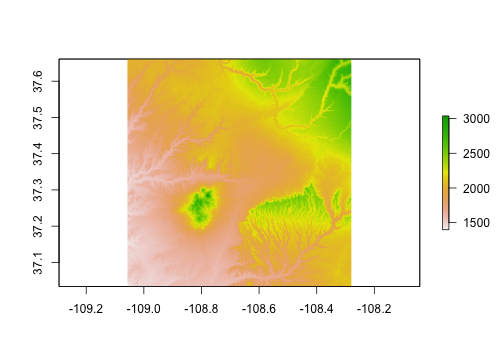
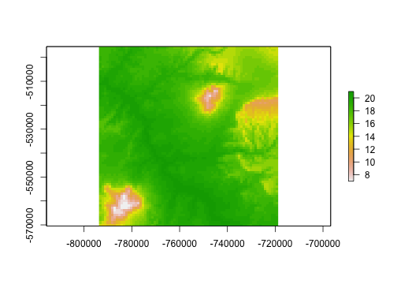
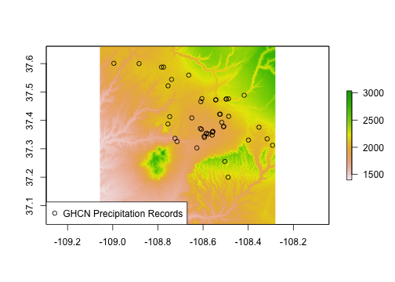
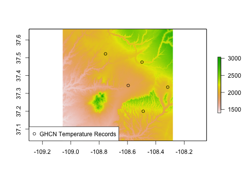
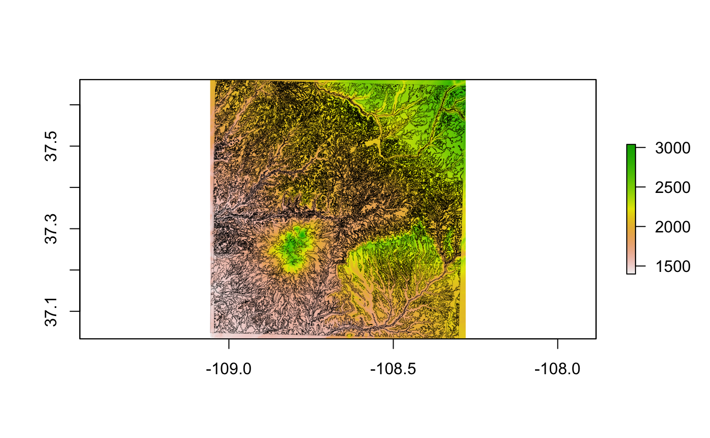
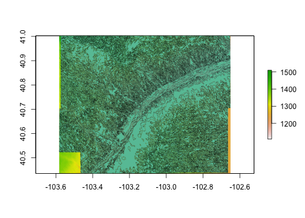
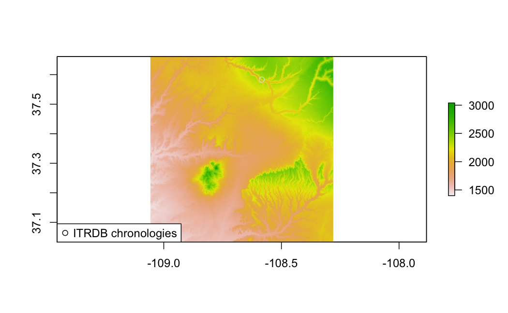
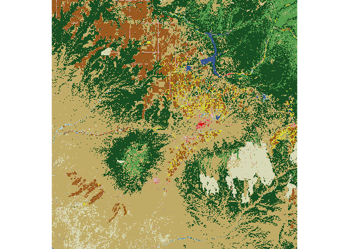
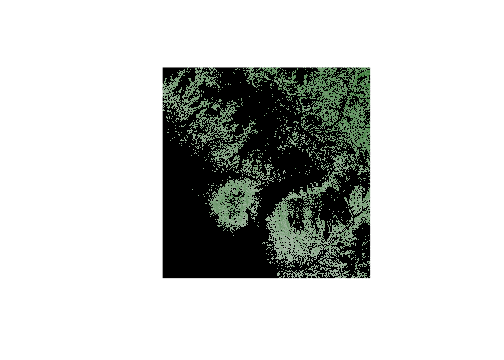
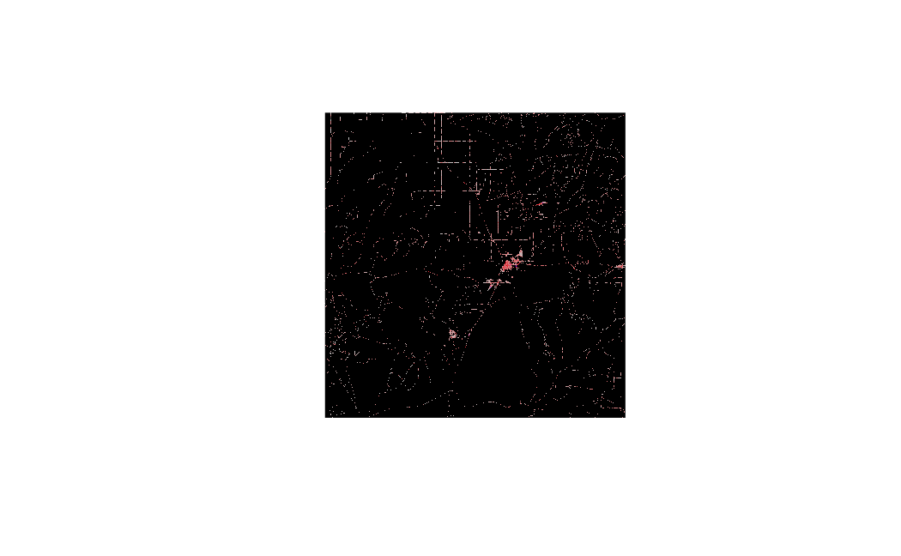

<!-- README.md is generated from README.Rmd. Please edit that file -->

**FedData version 3.0 is about to be released to CRAN. There are several
breaking changes in the FedData API from version 2.x. Please see
\[NEWS.md\] for a list of changes.**

`FedData` is an *R* package implementing functions to automate
downloading geospatial data available from several federated data
sources.

Currently, the package enables extraction from seven datasets:

-   The [National Elevation Dataset (NED)](http://ned.usgs.gov) digital
    elevation models (1, 1/3, and 1/9 arc-second; USGS)
-   The [National Hydrography Dataset (NHD)](http://nhd.usgs.gov) (USGS)
-   The [Soil Survey Geographic (SSURGO)
    database](http://websoilsurvey.sc.egov.usda.gov/) from the National
    Cooperative Soil Survey (NCSS), which is led by the Natural
    Resources Conservation Service (NRCS) under the USDA
-   The [Global Historical Climatology Network
    (GHCN)](http://www.ncdc.noaa.gov/data-access/land-based-station-data/land-based-datasets/global-historical-climatology-network-ghcn),
    coordinated by National Climatic Data Center at NOAA
-   The [Daymet](https://daymet.ornl.gov/) gridded estimates of daily
    weather parameters for North America, version 3, available from the
    Oak Ridge National Laboratory’s Distributed Active Archive Center
    (DAAC)
-   The [International Tree Ring Data Bank
    (ITRDB)](http://www.ncdc.noaa.gov/data-access/paleoclimatology-data/datasets/tree-ring),
    coordinated by National Climatic Data Center at NOAA
-   The [National Land Cover Database (NLCD)](https://www.mrlc.gov/)
-   The [NASS Cropland Data
    Layer](https://www.nass.usda.gov/Research_and_Science/Cropland/SARS1a.php)
    from the National Agricultural Statistics Service

This package is designed with the large-scale geographic information
system (GIS) use-case in mind: cases where the use of dynamic
web-services is impractical due to the scale (spatial and/or temporal)
of analysis. It functions primarily as a means of downloading tiled or
otherwise spatially-defined datasets; additionally, it can preprocess
those datasets by extracting data within an area of interest (AoI),
defined spatially. It relies heavily on the
[**sp**](https://cran.r-project.org/package=sp),
[**raster**](https://cran.r-project.org/package=raster), and
[**rgdal**](https://cran.r-project.org/package=rgdal) packages.

This package has been built and tested on a source (Homebrew) install of
*R* on macOS 10.14 (High Sierra), and has been successfully run on
Ubuntu 14.04.5 LTS (Trusty), Ubuntu 16.04.1 LTS (Xenial) and binary
installs of *R* on Mac OS 10.14 and Windows 10.

### Development

-   [Kyle Bocinsky](http://bocinsky.io) - Crow Canyon Archaeological
    Center, Cortez, CO

### Contributors

-   Dylan Beaudette - USDA-NRCS Soil Survey Office, Sonora, CA
-   Scott Chamberlain - ROpenSci and Museum of Paleontology at UC
    Berkeley

### Install `FedData`

-   From CRAN:

<!-- -->

    install.packages("FedData")

-   Development version from GitHub:

<!-- -->

    install.packages("devtools")
    devtools::install_github("ropensci/FedData")

-   Linux (Ubuntu 14.04.5 or 16.04.1):

First, in terminal:

    sudo add-apt-repository ppa:ubuntugis/ppa -y
    sudo apt-get update -q
    sudo apt-get install libssl-dev libcurl4-openssl-dev netcdf-bin libnetcdf-dev gdal-bin libgdal-dev

Then, in R:

    update.packages("survival")
    install.packages("devtools")
    devtools::install_github("ropensci/FedData")

### Demonstration

This demonstration script is available as an R Markdown document in the
GitHub repository: <https://github.com/ropensci/FedData>.

#### Load `FedData` and define a study area

    # FedData Tester
    library(FedData)
    library(magrittr)

    # Extract data for Mesa Verde National Park:
    vepPolygon <- polygon_from_extent(raster::extent(672800, 740000, 4102000, 4170000),
      proj4string = "+proj=utm +datum=NAD83 +zone=12"
    )

#### Get and plot the National Elevation Dataset for the study area

    # Get the NED (USA ONLY)
    # Returns a raster
    NED <- get_ned(
      template = vepPolygon,
      label = "VEPIIN"
    )
    #> Warning in showSRID(uprojargs, format = "PROJ", multiline = "NO"): Discarded
    #> datum Unknown based on WGS84 ellipsoid in CRS definition
    # Plot with raster::plot
    raster::plot(NED)

#### Get and plot the Daymet dataset for the study area

    # Get the DAYMET (North America only)
    # Returns a raster
    DAYMET <- get_daymet(
      template = vepPolygon,
      label = "VEPIIN",
      elements = c("prcp", "tmax"),
      years = 1980:1985
    )
    # Plot with raster::plot
    raster::plot(DAYMET$tmax$X1985.10.23)

#### Get and plot the daily GHCN precipitation data for the study area

    # Get the daily GHCN data (GLOBAL)
    # Returns a list: the first element is the spatial locations of stations,
    # and the second is a list of the stations and their daily data
    GHCN.prcp <- get_ghcn_daily(
      template = vepPolygon,
      label = "VEPIIN",
      elements = c("prcp")
    )
    #> Warning: `select_()` is deprecated as of dplyr 0.7.0.
    #> Please use `select()` instead.
    #> This warning is displayed once every 8 hours.
    #> Call `lifecycle::last_warnings()` to see where this warning was generated.
    # Plot the NED again
    raster::plot(NED)
    # Plot the spatial locations
    sp::plot(GHCN.prcp$spatial,
      pch = 1,
      add = TRUE
    )
    legend("bottomleft",
      pch = 1,
      legend = "GHCN Precipitation Records"
    )

#### Get and plot the daily GHCN temperature data for the study area

    # Elements for which you require the same data
    # (i.e., minimum and maximum temperature for the same days)
    # can be standardized using standardize==T
    GHCN.temp <- get_ghcn_daily(
      template = vepPolygon,
      label = "VEPIIN",
      elements = c("tmin", "tmax"),
      years = 1980:1985,
      standardize = TRUE
    )
    #> Warning: `filter_()` is deprecated as of dplyr 0.7.0.
    #> Please use `filter()` instead.
    #> See vignette('programming') for more help
    #> This warning is displayed once every 8 hours.
    #> Call `lifecycle::last_warnings()` to see where this warning was generated.
    # Plot the NED again
    raster::plot(NED)
    # Plot the spatial locations
    sp::plot(GHCN.temp$spatial,
      add = TRUE,
      pch = 1
    )
    legend("bottomleft",
      pch = 1,
      legend = "GHCN Temperature Records"
    )

#### Get and plot the National Hydrography Dataset for the study area

    # Get the NHD (USA ONLY)
    get_nhd(
      template = FedData::glac,
      label = "glac"
    ) %>%
      plot_nhd(template = FedData::glac)

#### Get and plot the NRCS SSURGO data for the study area

    # Get the NRCS SSURGO data (USA ONLY)
    SSURGO.VEPIIN <- get_ssurgo(
      template = vepPolygon,
      label = "VEPIIN"
    )
    # Plot the NED again
    raster::plot(NED)
    # Plot the SSURGO mapunit polygons
    plot(SSURGO.VEPIIN$spatial,
      lwd = 0.1,
      add = TRUE
    )

#### Get and plot the NRCS SSURGO data for particular soil survey areas

    # Or, download by Soil Survey Area names
    SSURGO.areas <- get_ssurgo(
      template = c("CO670", "CO075"),
      label = "CO_TEST"
    )

    # Let's just look at spatial data for CO675
    SSURGO.areas.CO675 <-
      SSURGO.areas$spatial %>%
      dplyr::filter(AREASYMBOL == "CO075")

    # And get the NED data under them for pretty plotting
    NED.CO675 <- get_ned(
      template = SSURGO.areas.CO675,
      label = "SSURGO_CO675"
    )
    #> Warning in if (class(x) != "extent") {: the condition has length > 1 and only
    #> the first element will be used
    #> Warning in showSRID(uprojargs, format = "PROJ", multiline = "NO"): Discarded
    #> datum Unknown based on WGS84 ellipsoid in CRS definition

    # Plot the SSURGO mapunit polygons, but only for CO675
    plot(NED.CO675)
    plot(SSURGO.areas.CO675,
      lwd = 0.1,
      add = TRUE
    )
    #> Warning in plot.sf(SSURGO.areas.CO675, lwd = 0.1, add = TRUE): ignoring all but
    #> the first attribute

#### Get and plot the ITRDB chronology locations in the study area

    # Get the ITRDB records
    ITRDB <- get_itrdb(
      template = vepPolygon,
      label = "VEPIIN",
      recon.years = 850:2000,
      calib.years = 1924:1983,
      measurement.type = "Ring Width",
      chronology.type = "ARSTND"
    )
    #> Warning in eval(jsub, SDenv, parent.frame()): NAs introduced by coercion
    #> Warning: attribute variables are assumed to be spatially constant throughout all
    #> geometries

    # Plot the NED again
    raster::plot(NED)
    # Map the locations of the tree ring chronologies
    plot(ITRDB$metadata$geometry,
      pch = 1,
      add = TRUE
    )
    legend("bottomleft",
      pch = 1,
      legend = "ITRDB chronologies"
    )

#### Get and plot the National Land Cover Dataset for the study area

    # Get the NLCD (USA ONLY)
    # Returns a raster
    NLCD <- get_nlcd(
      template = vepPolygon,
      year = 2016,
      dataset = "Land_Cover",
      label = "VEPIIN"
    )
    #> Warning in showSRID(uprojargs, format = "PROJ", multiline = "NO"): Discarded
    #> ellps WGS 84 in CRS definition: +proj=merc +a=6378137 +b=6378137 +lat_ts=0
    #> +lon_0=0 +x_0=0 +y_0=0 +k=1 +units=m +nadgrids=@null +wktext +no_defs
    #> Warning in showSRID(uprojargs, format = "PROJ", multiline = "NO"): Discarded
    #> datum WGS_1984 in CRS definition
    # Plot with raster::plot
    raster::plot(NLCD)

    # You can also download the Canopy (2011 only) or impervious datasets:
    NLCD_canopy <- get_nlcd(
      template = vepPolygon,
      year = 2011,
      dataset = "Tree_Canopy",
      label = "VEPIIN"
    )
    #> Warning in showSRID(uprojargs, format = "PROJ", multiline = "NO"): Discarded
    #> ellps WGS 84 in CRS definition: +proj=merc +a=6378137 +b=6378137 +lat_ts=0
    #> +lon_0=0 +x_0=0 +y_0=0 +k=1 +units=m +nadgrids=@null +wktext +no_defs

    #> Warning in showSRID(uprojargs, format = "PROJ", multiline = "NO"): Discarded
    #> datum WGS_1984 in CRS definition
    # Plot with raster::plot
    raster::plot(NLCD_canopy)

    NLCD_impervious <- get_nlcd(
      template = vepPolygon,
      year = 2016,
      dataset = "Impervious",
      label = "VEPIIN"
    )
    #> Warning in showSRID(uprojargs, format = "PROJ", multiline = "NO"): Discarded
    #> ellps WGS 84 in CRS definition: +proj=merc +a=6378137 +b=6378137 +lat_ts=0
    #> +lon_0=0 +x_0=0 +y_0=0 +k=1 +units=m +nadgrids=@null +wktext +no_defs

    #> Warning in showSRID(uprojargs, format = "PROJ", multiline = "NO"): Discarded
    #> datum WGS_1984 in CRS definition
    # Plot with raster::plot
    raster::plot(NLCD_impervious)

#### Get and plot the NASS Cropland Data Layer for the study area

    # Get the NASS (USA ONLY)
    # Returns a raster
    NASS <- get_nass(
      template = vepPolygon,
      year = 2016,
      label = "VEPIIN"
    )
    # Plot with raster::plot
    raster::plot(NASS)

    # Get the NASS classification table
    raster::levels(NASS)[[1]]

------------------------------------------------------------------------

### Acknowledgements

This package is a product of SKOPE ([Synthesizing Knowledge of Past
Environments](http://www.openskope.org)) and the [Village Ecodynamics
Project](http://veparchaeology.org) through grants awarded to the [Crow
Canyon Archaeological Center](https://www.crowcanyon.org) and Washington
State University by the National Science Foundation. This software is
licensed under the [MIT license](https://opensource.org/licenses/MIT).

FedData was reviewed for [rOpenSci](https://ropensci.org) by
[@jooolia](https://github.com/jooolia), and was greatly improved as a
result. [rOpenSci](https://ropensci.org) on-boarding was coordinated by
[@sckott](https://github.com/sckott).

<!--  -->
