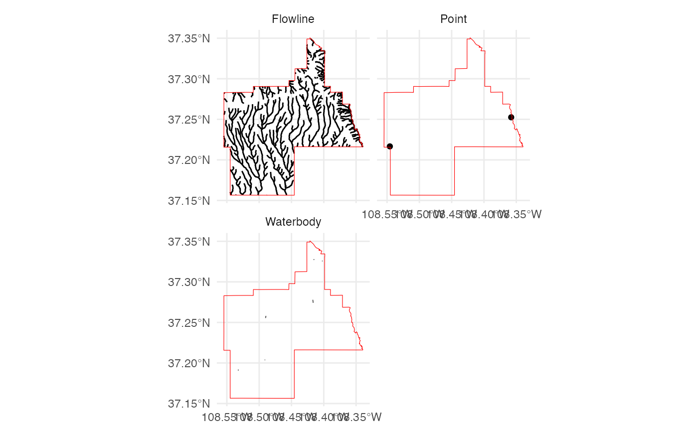
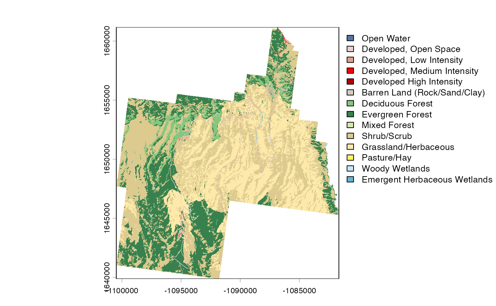
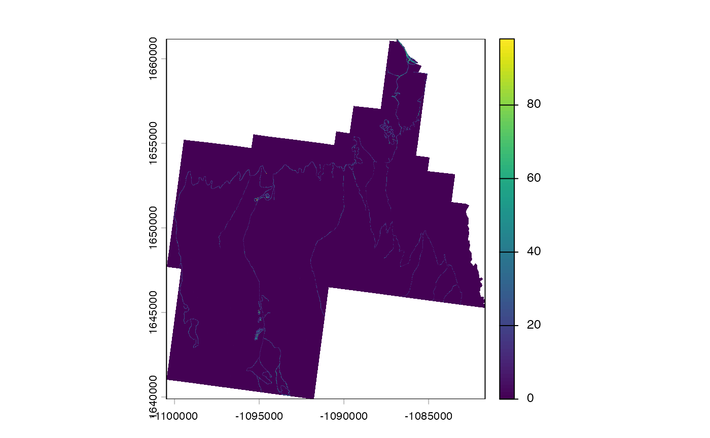
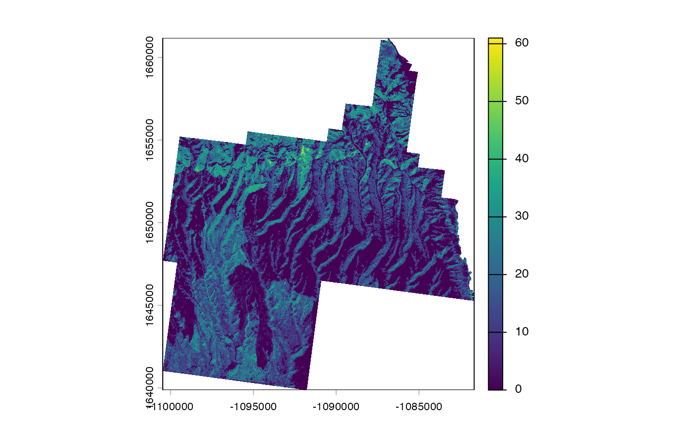
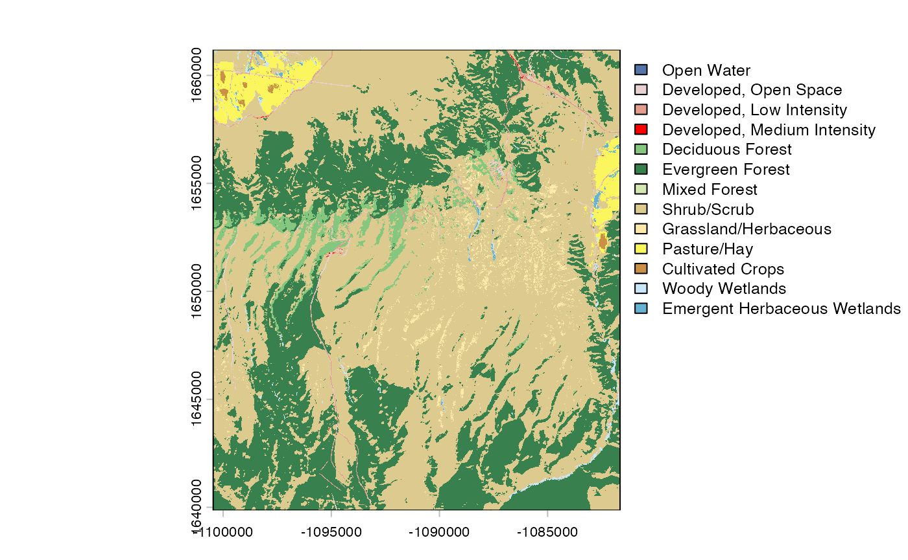
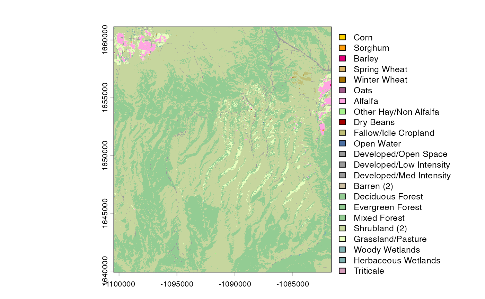

# Introduction to FedData

`FedData` is a package for downloading data from federated (usually US
Federal) data sets, using a consistent, spatial-first API. In this
vignette, you’ll learn how to load the `FedData` package, download data
for an “template” area of interest, and make simple web maps using the
[`mapview`](https://r-spatial.github.io/mapview/) package.

## Load `FedData` and define a study area

``` r

# Load FedData and magrittr
library(FedData)
library(magrittr)
library(terra)

# Install mapview if necessary
if (!require("mapview")) {
  install.packages("mapview")
}

library(mapview)
mapviewOptions(
  basemaps = c(),
  homebutton = FALSE,
  query.position = "topright",
  query.digits = 2,
  query.prefix = "",
  legend.pos = "bottomright",
  platform = "leaflet",
  fgb = TRUE,
  georaster = TRUE
)

# Create a nice mapview template
plot_map <-
  function(x, ...) {
    if (inherits(x, "SpatRaster")) {
      x %<>%
        as("Raster")
    }

    bounds <-
      FedData::meve %>%
      sf::st_bbox() %>%
      as.list()

    mapview::mapview(x, ...)@map %>%
      leaflet::removeLayersControl() %>%
      leaflet::addTiles(
        urlTemplate = "https://basemap.nationalmap.gov/ArcGIS/rest/services/USGSShadedReliefOnly/MapServer/tile/{z}/{y}/{x}"
      ) %>%
      leaflet::addTiles(
        urlTemplate = "https://tiles.stadiamaps.com/tiles/stamen_toner_lines/{z}/{x}/{y}.png"
      ) %>%
      leaflet::addTiles(
        urlTemplate = "https://tiles.stadiamaps.com/tiles/stamen_toner_labels/{z}/{x}/{y}.png"
      ) %>%
      # leaflet::addProviderTiles("Stamen.TonerLines") %>%
      # leaflet::addProviderTiles("Stamen.TonerLabels") %>%
      leaflet::addPolygons(
        data = FedData::meve,
        color = "black",
        fill = FALSE,
        options = list(pointerEvents = "none"),
        highlightOptions = list(sendToBack = TRUE)
      ) %>%
      leaflet::fitBounds(
        lng1 = bounds$xmin,
        lng2 = bounds$xmax,
        lat1 = bounds$ymin,
        lat2 = bounds$ymax
      )
  }


# FedData comes loaded with the boundary of Mesa Verde National Park, for testing
FedData::meve
#> Geometry set for 1 feature 
#> Geometry type: POLYGON
#> Dimension:     XY
#> Bounding box:  xmin: -108.5547 ymin: 37.15642 xmax: -108.3396 ymax: 37.35052
#> Geodetic CRS:  WGS 84

plot_map(FedData::meve,
  legend = FALSE
)
```

## Datasets

### USGS National Elevation Dataset

``` r

# Get the NED (USA ONLY)
# Returns a raster
NED <- get_ned(
  template = FedData::meve,
  label = "meve"
)

plot_map(NED,
  layer.name = "NED Elevation (m)",
  maxpixels = terra::ncell(NED)
)
```

### ORNL Daymet

[`get_daymet()`](https://docs.ropensci.org/FedData/reference/get_daymet.md)
is deprecated, and currently non-functional. In 2025, the ORNL
Distributed Active Archive Center retired the public THREDDS data server
that FedData used to subset and download gridded Daymet data. Gridded
Daymet data are now distributed through the NASA Earthdata Cloud, which
requires (free) authentication with a [NASA Earthdata
Login](https://urs.earthdata.nasa.gov), and are also available from
[Google Earth
Engine](https://developers.google.com/earth-engine/datasets/catalog/NASA_ORNL_DAYMET_V4).
Point (“single-pixel”) extractions remain freely available via the
[Daymet single-pixel extraction tool](https://daymet.ornl.gov/getdata),
accessible from R with the
[daymetr](https://github.com/bluegreen-labs/daymetr) package. Support
for gridded Daymet downloads with Earthdata authentication may return in
a future release of FedData.

``` r

# Get the DAYMET (North America only)
# Returns a raster
DAYMET <- get_daymet(
  template = FedData::meve,
  label = "meve",
  elements = c("prcp", "tmax"),
  years = 1985
)

plot_map(DAYMET$tmax$`1985-10-23`,
  layer.name = "TMAX on 23 Oct 1985 (Degrees C)",
  maxpixels = terra::ncell(DAYMET$tmax)
)
```

### NOAA GHCN-daily

``` r

# Get the daily GHCN data (GLOBAL)
# Returns a list: the first element is the spatial locations of stations,
# and the second is a list of the stations and their daily data
GHCN.prcp <- get_ghcn_daily(
  template = FedData::meve,
  label = "meve",
  elements = c("prcp")
)

GHCN.prcp$spatial %>%
  dplyr::mutate(label = paste0(ID, ": ", NAME)) %>%
  plot_map(
    label = "label",
    layer.name = "GHCN_prcp",
    legend = FALSE
  )
```

#### Standardized data

``` r

# Elements for which you require the same data
# (i.e., minimum and maximum temperature for the same days)
# can be standardized using standardize==T
GHCN.temp <- get_ghcn_daily(
  template = FedData::meve,
  label = "meve",
  elements = c("tmin", "tmax"),
  years = 1980:1985,
  standardize = TRUE
)

GHCN.temp$spatial %>%
  dplyr::mutate(label = paste0(ID, ": ", NAME)) %>%
  plot_map(
    label = "label",
    layer.name = "GHCN_temp",
    legend = FALSE
  )
```

### USGS National Hydrography Dataset

``` r

# Get the NHD (USA ONLY)
NHD <-
  get_nhd(
    template = FedData::meve,
    label = "meve",
    force.redo = TRUE
  )

# FedData comes with a simple plotting function for NHD data
plot_nhd(NHD, template = FedData::meve)
```



``` r


# Or, do an interactive map
NHD[purrr::map_lgl(NHD, ~ (nrow(.x) != 0))] %>%
  plot_map()
```

``` r


# You can also retrieve the Watershed Boundary Dataset
WBD <-
  get_wbd(
    template = FedData::meve,
    label = "meve"
  )

plot_map(WBD,
  zcol = "name",
  legend = FALSE
)
```

### USDA NRCS SSURGO

``` r

# Get the NRCS SSURGO data (USA ONLY)
SSURGO.MEVE <- get_ssurgo(
  template = FedData::meve,
  label = "meve"
)

SSURGO.MEVE$spatial %>%
  rmapshaper::ms_simplify() %>%
  dplyr::left_join(
    SSURGO.MEVE$tabular$mapunit %>%
      dplyr::mutate(mukey = as.character(mukey)),
    by = c("MUKEY" = "mukey")
  ) %>%
  dplyr::mutate(label = paste0(MUKEY, ": ", muname)) %>%
  dplyr::select(-musym) %>%
  plot_map(
    zcol = "label",
    legend = FALSE
  )
```

#### SSURGO by Soil Survey Area

``` r

# Or, download by Soil Survey Area names
SSURGO.areas <- get_ssurgo(
  template = c("CO670"),
  label = "CO670"
)

SSURGO.areas$spatial %>%
  rmapshaper::ms_simplify() %>%
  dplyr::left_join(
    SSURGO.areas$tabular$muaggatt %>%
      dplyr::mutate(mukey = as.character(mukey)),
    by = c("MUKEY" = "mukey")
  ) %>%
  dplyr::mutate(label = paste0(MUKEY, ": ", muname)) %>%
  dplyr::select(-musym) %>%
  plot_map(
    zcol = "brockdepmin",
    layer.name = "Minimum Bedrock Depth (cm)",
    label = "label"
  )
```

### ITRDB

``` r

# Get the ITRDB records
# Buffer MEVE, because there aren't any chronologies in the Park
ITRDB <-
  get_itrdb(
    template = FedData::meve %>%
      sf::st_buffer(50000),
    label = "meve",
    measurement.type = "Ring Width",
    chronology.type = "Standard"
  )
#> Warning: attribute variables are assumed to be spatially constant throughout
#> all geometries

plot_map(ITRDB$metadata,
  zcol = "SPECIES",
  layer.name = "Species",
  label = "NAME"
) %>%
  leaflet::setView(
    lat = sf::st_centroid(FedData::meve) %>%
      sf::st_coordinates() %>%
      as.numeric() %>%
      magrittr::extract2(2),
    lng = sf::st_centroid(FedData::meve) %>%
      sf::st_coordinates() %>%
      as.numeric() %>%
      magrittr::extract2(1),
    zoom = 9
  )
```

### USGS National Land Cover Dataset

``` r

# Get the NLCD (USA ONLY)
# Returns a raster
NLCD <- get_nlcd(
  template = FedData::meve,
  year = 2019,
  label = "meve"
)

plot(NLCD)
```



``` r


# Also get the impervious or canopy datasets
NLCD_impervious <-
  get_nlcd(
    template = FedData::meve,
    year = 2019,
    label = "meve_impervious",
    dataset = "impervious"
  )

plot(NLCD_impervious)
```



``` r


NLCD_canopy <-
  get_nlcd(
    template = FedData::meve,
    year = 2019,
    label = "meve_canopy",
    dataset = "canopy"
  )

plot(NLCD_canopy)
```



### Annual National Landcover Dataset

``` r

# Get the NLCD (USA ONLY)
# Returns a raster
NLCD_ANNUAL <-
  get_nlcd_annual(
    template = FedData::meve,
    label = "meve",
    year = 2020,
    product =
      c(
        "LndCov",
        "LndChg",
        "LndCnf",
        "FctImp",
        "ImpDsc",
        "SpcChg"
      )
  )

# Returns a data.frame of all downloaded data
NLCD_ANNUAL
#> # A tibble: 6 × 7
#> # Rowwise: 
#>   product  year region collection version outfile             rast              
#>   <ord>   <int> <ord>       <int>   <int> <glue>              <list>            
#> 1 LndCov   2020 CU              1       1 /var/folders/j_/6v… <SpatRstr[,627,1]>
#> 2 LndChg   2020 CU              1       1 /var/folders/j_/6v… <SpatRstr[,627,1]>
#> 3 LndCnf   2020 CU              1       1 /var/folders/j_/6v… <SpatRstr[,627,1]>
#> 4 FctImp   2020 CU              1       1 /var/folders/j_/6v… <SpatRstr[,627,1]>
#> 5 ImpDsc   2020 CU              1       1 /var/folders/j_/6v… <SpatRstr[,627,1]>
#> 6 SpcChg   2020 CU              1       1 /var/folders/j_/6v… <SpatRstr[,627,1]>

plot(NLCD_ANNUAL$rast[[1]])
```



### USDA NASS Cropland Data Layer

``` r

# Get the NASS (USA ONLY)
# Returns a raster
NASS_CDL <- get_nass_cdl(
  template = FedData::meve,
  year = 2016,
  label = "meve"
)

plot(NASS_CDL)
```



### USGS PAD-US

``` r

# Get the PAD-US data (USA ONLY)
PADUS <- get_padus(
  template = sf::st_buffer(FedData::meve, 1000),
  label = "meve"
)

plot_map(
  PADUS$Manager_Name,
  layer.name = "Unit Name",
  zcol = "Unit_Nm"
)
```

``` r


# Optionally, specify your unit names
PADUS_meve_ute <- get_padus(
  template = c("Mesa Verde National Park", "Ute Mountain Reservation"),
  label = "meve_ute"
)

plot_map(
  PADUS_meve_ute$Manager_Name,
  layer.name = "Unit Name",
  zcol = "Unit_Nm"
)
```
